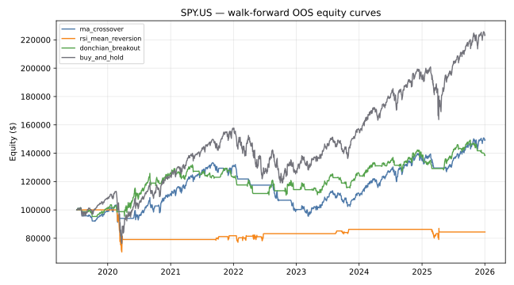
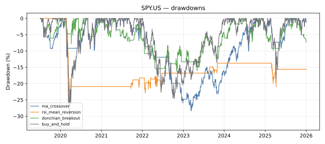
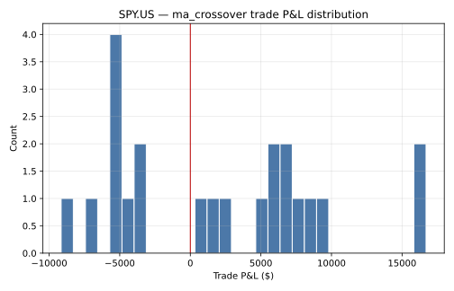
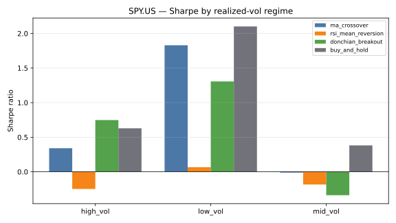
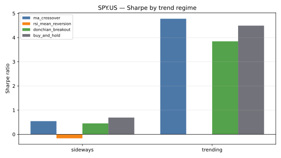

# Walk-Forward Strategy Backtester

Retail-style technical strategies (moving-average crossover, RSI mean-reversion,
Donchian breakout) are easy to overfit: pick the lookback window that happened
to work on the last five years and you'll show a beautiful backtest that falls
apart live. This project asks a narrower, more honest question: **once
parameters are chosen only on data the strategy has already seen, and tested
strictly on data it hasn't, do any of these three classic strategies beat a
buy-and-hold benchmark — and does the answer depend on the market regime?**

It's an event-driven backtesting engine with realistic execution frictions
(commission, slippage, next-bar fills, stop-loss/take-profit, position sizing)
wrapped in a rolling walk-forward validation framework, so every reported
number is genuinely out-of-sample.

## Methodology

**Strategies** (`src/walkforward_backtester/strategies.py`), all sharing one
`generate_signals(df) -> Series` interface:

- **MA Crossover** — long while a fast SMA sits above a slow SMA.
- **RSI Mean-Reversion** — buy when RSI drops below an oversold threshold,
  exit once RSI recovers past a neutral line.
- **Donchian Breakout** — long on a close above the prior N-day high, exit on
  a close below a shorter M-day low (Turtle-style channel breakout).

**Execution** (`execution.py`) is a bar-by-bar simulation, not a vectorized
shortcut. A signal computed from information available through the close of
day *t* is only actionable at the **open of day t+1** — strategies never see
their own shifted output, so there is no way for a signal to trade on
information from its own bar. Each fill pays commission (bps of notional) and
slippage (either a flat bps or a volatility-scaled bps that widens when
recent realized volatility is elevated). Position size is either a fixed
fraction of capital or volatility-targeted (leverage solved so the position's
expected annualized vol hits a target), always capped by a max gross
exposure. Optional percentage stop-loss / take-profit levels are checked
intrabar (against the day's high/low) before any signal-driven exit.

**Walk-forward validation** (`walkforward.py`) splits history into rolling
folds of **2y train → 1y validation → 6mo test**, rolling forward 6 months
each time. Each strategy's parameter grid (e.g. `fast × slow` for the
crossover) is searched by maximizing Sharpe ratio on the *validation* segment
only; the winning parameters are then run, untouched, on the *test* segment.
The train segment exists purely to warm up indicators (e.g. a 200-day SMA
needs 200 days of history before validation starts) — these strategies have
no statistical fit step, so nothing is "trained" on it. Test segments across
all folds are chained into one continuous out-of-sample equity curve per
strategy, capital reset at each fold boundary so strategies are compared on
identical, independent allocation windows.

**Regime analysis** (`regime.py`) is computed *after* the fact from the
already-realized OOS returns: realized-volatility terciles (low/mid/high) and
a Kaufman efficiency-ratio trend/sideways split. It's descriptive only and
never feeds back into parameter selection.

## Data

Daily OHLCV for SPY, AAPL, QQQ and TLT (2016-07-05 to 2026-07-02, ~2,513 bars
each) sourced live from Yahoo Finance's public chart API, with stooq.com
attempted first. **stooq.com now sits behind a JavaScript proof-of-work
anti-bot challenge that blocks plain HTTP clients**, so in this environment
the loader falls through to Yahoo automatically; a bundled local cache under
`data/cache/` is the final fallback if both live sources are unreachable, so
the demo never breaks on a network hiccup. See `src/walkforward_backtester/data.py`.

## Install & usage

```bash
git clone https://github.com/gilhermanns/walkforward-backtester.git
cd walkforward-backtester
python3 -m venv .venv && source .venv/bin/activate
pip install -e .

pytest -q                        # run the test suite
python scripts/run_analysis.py   # regenerate reports/ and docs/img/ from real data
```

```python
from walkforward_backtester.data import load_prices
from walkforward_backtester.strategies import MovingAverageCrossover
from walkforward_backtester.walkforward import WalkForwardSplitter, run_walkforward
import pandas as pd

df = load_prices("spy.us")
splitter = WalkForwardSplitter(
    train_period=pd.DateOffset(years=2),
    val_period=pd.DateOffset(years=1),
    test_period=pd.DateOffset(months=6),
)
outcomes = run_walkforward(MovingAverageCrossover, df, splitter)
```

## Results

All numbers below come from an actual run of `scripts/run_analysis.py`
against the live-fetched 10-year history (2016-07-05 → 2026-07-02, out-of-
sample window 2019-07-05 → 2026-01-05, 13 walk-forward folds). $100,000
starting capital, 5 bps commission, 5 bps slippage, 95% fixed-fraction
sizing, no stop-loss/take-profit. Full CSVs are in `reports/`.

### SPY — headline comparison

| strategy | cagr | sharpe | max_drawdown | calmar | annualized_vol | num_trades | win_rate | profit_factor | avg_trade_pnl |
|---|---|---|---|---|---|---|---|---|---|
| ma_crossover | 6.36% | 0.58 | -28.36% | 0.22 | 11.86% | 22 | 59.09% | 1.91 | $2,034 |
| rsi_mean_reversion | -2.58% | -0.16 | -29.71% | -0.09 | 11.96% | 15 | 53.33% | 0.46 | -$1,045 |
| donchian_breakout | 5.15% | 0.51 | -16.26% | 0.32 | 10.97% | 44 | 47.73% | 1.62 | $713 |
| buy_and_hold | 13.17% | 0.74 | -32.63% | 0.40 | 19.43% | 1 | 100.00% | inf | $123,372 |




### Trade P&L distribution (best Sharpe strategy on SPY: Donchian breakout)



### Regime split (SPY out-of-sample window)

Realized-vol tercile Sharpe:

| strategy | high_vol | mid_vol | low_vol |
|---|---|---|---|
| ma_crossover | 0.34 | -0.01 | 1.83 |
| rsi_mean_reversion | -0.25 | -0.18 | 0.07 |
| donchian_breakout | 0.75 | -0.34 | 1.31 |
| buy_and_hold | 0.63 | 0.38 | 2.10 |

Trend vs. sideways Sharpe (60-day Kaufman efficiency ratio):

| strategy | sideways | trending |
|---|---|---|
| ma_crossover | 0.55 | 4.78 |
| rsi_mean_reversion | -0.17 | 0.00 |
| donchian_breakout | 0.45 | 3.85 |
| buy_and_hold | 0.69 | 4.49 |




The pattern is exactly what the strategy logic predicts: both trend-following
strategies (MA crossover, Donchian) have their best risk-adjusted performance
in the small number of strongly-trending days, and are flat-to-negative in
sideways stretches. RSI mean-reversion never clears a 0 Sharpe in any regime
on SPY over this window — a straightforward, honest negative result, not
massaged away.

### Cross-ticker robustness (headline CAGR / Sharpe, same walk-forward setup)

| ticker | strategy | cagr | sharpe |
|---|---|---|---|
| AAPL | ma_crossover | 15.04% | 0.78 |
| AAPL | rsi_mean_reversion | 6.69% | 0.47 |
| AAPL | donchian_breakout | 13.41% | 0.79 |
| AAPL | buy_and_hold | 28.80% | 0.98 |
| QQQ | ma_crossover | 8.96% | 0.63 |
| QQQ | rsi_mean_reversion | 6.09% | 0.52 |
| QQQ | donchian_breakout | 9.93% | 0.81 |
| QQQ | buy_and_hold | 19.13% | 0.86 |
| TLT | ma_crossover | 0.16% | 0.07 |
| TLT | rsi_mean_reversion | -1.79% | -0.30 |
| TLT | donchian_breakout | -2.44% | -0.25 |
| TLT | buy_and_hold | -5.97% | -0.31 |

Full per-ticker tables: `reports/comparison_*.csv`. Full-fidelity trade logs
(entry/exit price, reason, commission, slippage, P&L per trade):
`reports/trades_<strategy>_<ticker>.csv`.

**Bottom line:** over this decade — one of the strongest sustained equity
bull runs in market history — none of the three rule-based strategies beat
buy-and-hold on SPY, AAPL or QQQ after realistic frictions, even with
walk-forward parameter selection. They *do* meaningfully outperform
buy-and-hold on TLT, where the underlying asset itself lost money — the
strategies' ability to sit in cash during the bond bear market mattered more
than their entry timing. That asymmetry (works when the passive benchmark is
bad, doesn't add value when the benchmark is good) is a realistic and
common finding for this class of strategy, not a flaw in the harness.

## Limitations & next steps

- **Single-asset engine.** Each backtest run trades one instrument; there is
  no cross-asset portfolio allocation, correlation, or capital sharing across
  the four tickers.
- **Regime labels are in-sample over the OOS window itself.** The vol/trend
  terciles are computed on the same out-of-sample period being scored, so
  the regime split is a descriptive lens on what happened, not a predictive
  signal a live strategy could have used in real time.
- **No overnight gap risk model** beyond next-bar open fills — a genuine
  gap-through-stop scenario is not simulated separately from a normal
  intrabar stop check.
- **Capital resets at each fold boundary** in the stitched OOS curve, which
  makes strategies directly comparable but is not identical to a single
  unbroken live-trading equity curve (a real trader would carry positions
  and losses/gains across fold boundaries rather than reallocating fresh
  capital every 6 months).
- **stooq.com's anti-bot challenge** blocked automated CSV access during
  development; the loader already falls back to Yahoo's chart API and then
  to a bundled cache, but a production version would want a paid data vendor
  for guaranteed uptime.
- Natural extensions: multi-asset portfolio-level risk budgeting, intraday
  data for tighter fill realism, walk-forward re-optimization of regime
  thresholds themselves, and a proper transaction-cost model calibrated to
  each ticker's actual bid-ask spread rather than a flat bps assumption.
